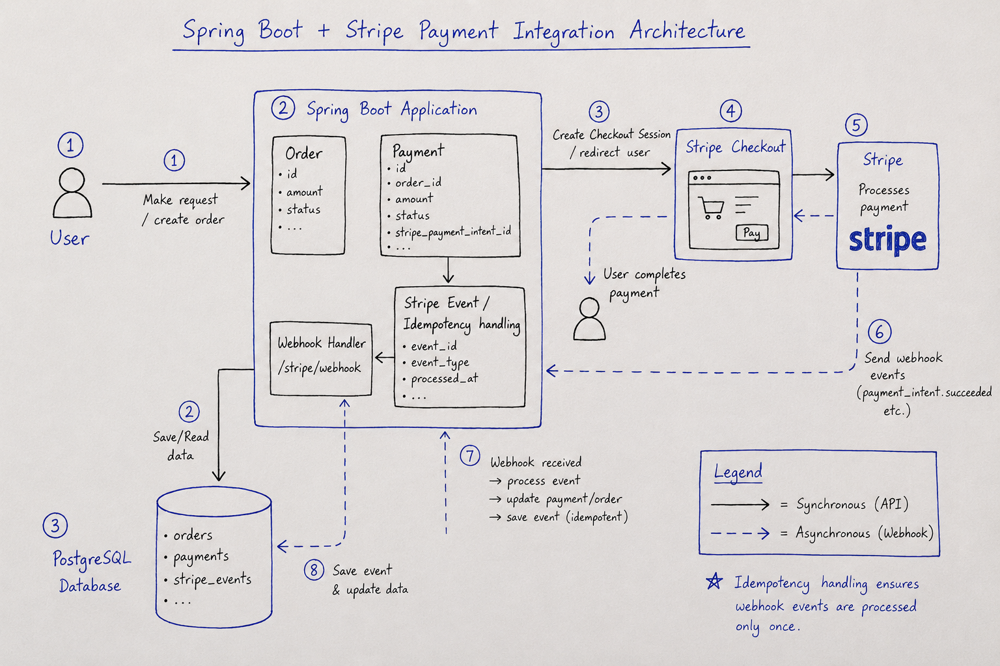
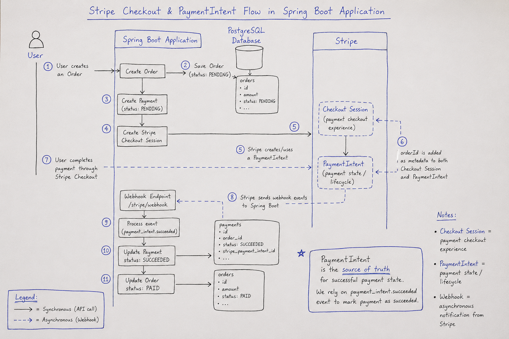
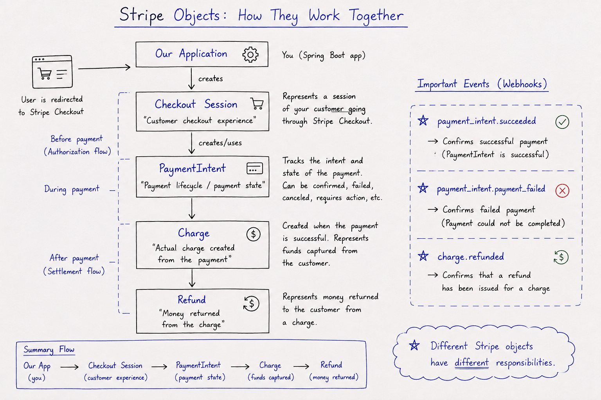
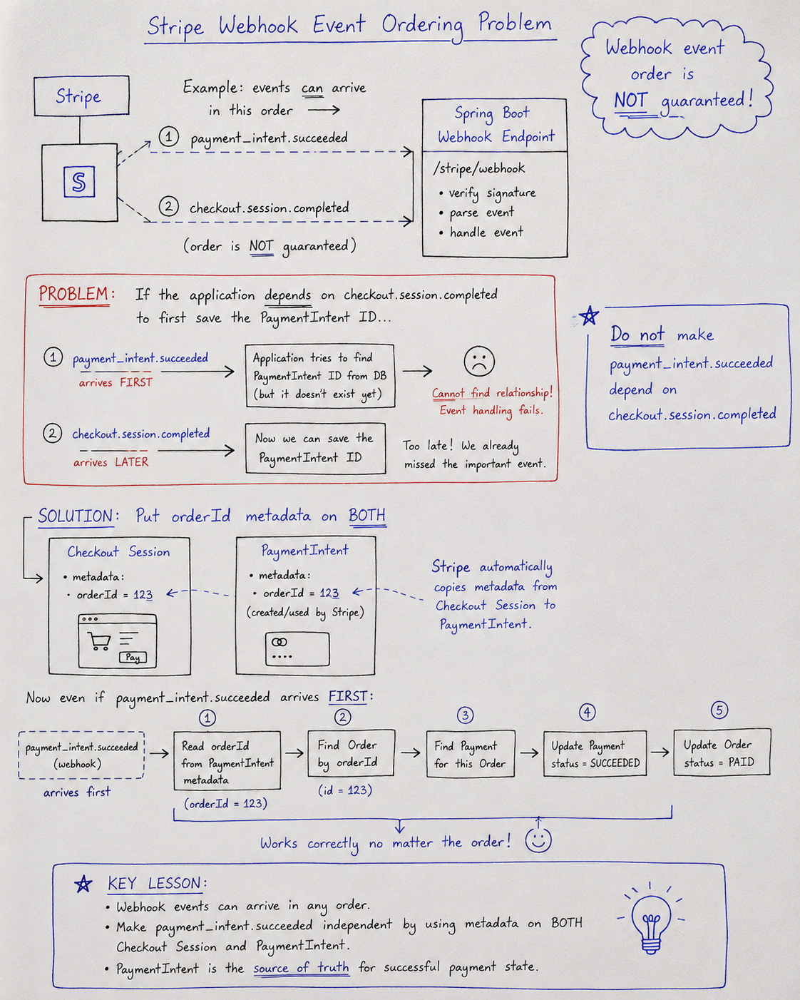
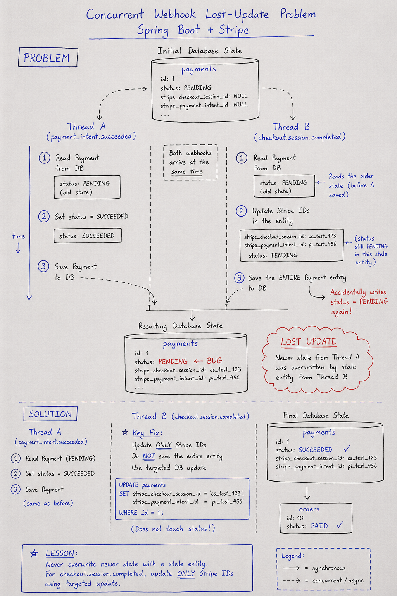
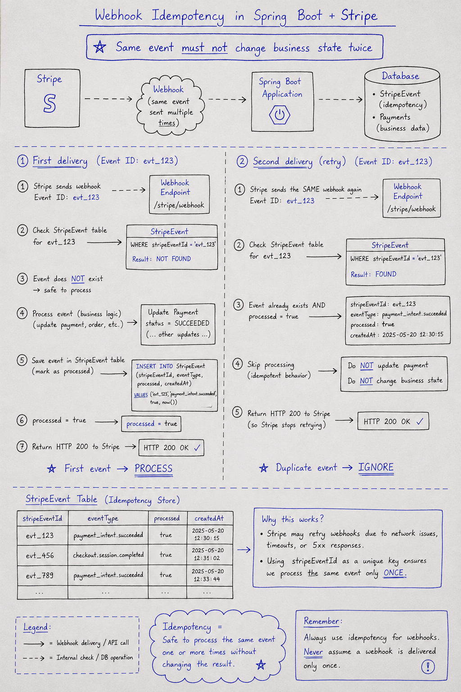
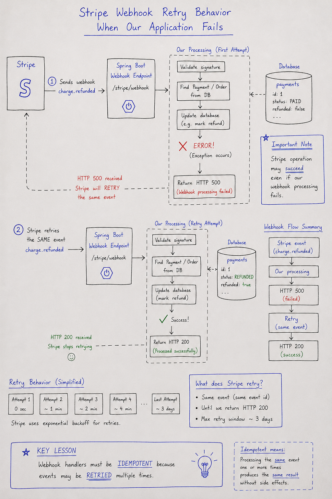
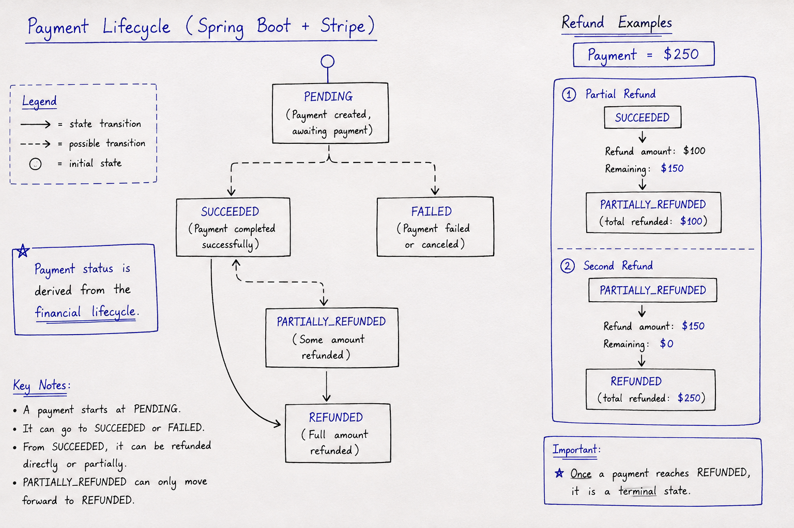
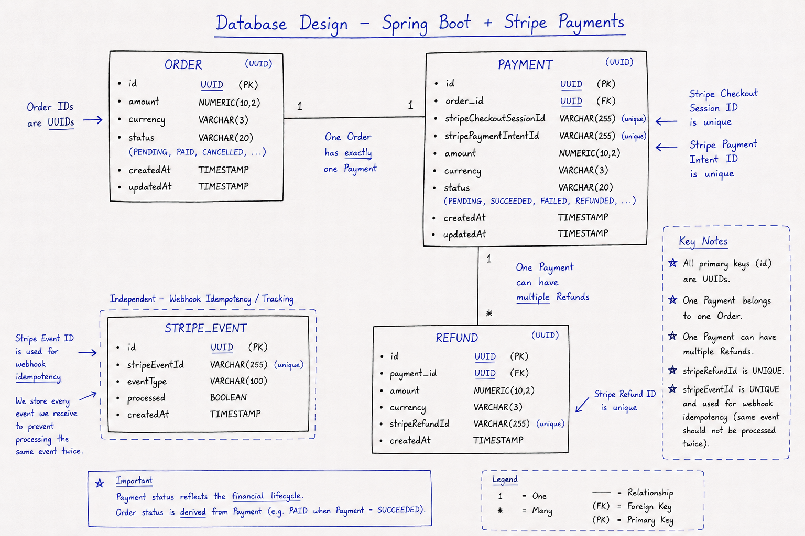

# Stripe Payment Integration with Spring Boot

A Spring Boot + Stripe educational project that demonstrates a realistic,
webhook-driven payment flow: **Checkout Session**, **PaymentIntent**, **Stripe
webhooks with signature verification**, **database persistence**, and a full
**refund system** (full, partial, and multiple refunds).

This project was built primarily as a **learning project**. It focuses on what
is often the hardest part of real payment systems: correctly processing
asynchronous webhook events in the face of **unreliable ordering**,
**duplicate delivery**, **concurrency**, and **retries**.

> All financial state changes are driven by Stripe webhooks, not by optimistic
> client responses. This mirrors how production payment systems must stay
> consistent with the payment provider.

---

## Why This Project?

Integrating Stripe is easy when you follow the happy path. The interesting
engineering comes from building a system that stays **correct** when the real
world misbehaves:

- **Stripe integration** — Checkout, PaymentIntent, Charge, and Refund.
- **Webhooks** — asymmetric event delivery that must be verified and parsed
  safely.
- **Asynchronous systems** — events arrive at arbitrary times, not in a neat
  request/response loop.
- **Event ordering** — Stripe does not guarantee webhook delivery order.
- **Idempotency** — the same event or refund must never be applied twice.
- **Concurrency** — simultaneous webhooks must not lose updates.
- **Retries** — failed webhook processing must be safe to retry.
- **Refunds** — full, partial, and multiple refunds tracked against a payment.

Each of these topics is a real-world problem that this project implements and,
where possible, demonstrates a failure that was actually hit and fixed.

---

## Architecture



The application is a single Spring Boot service backed by PostgreSQL:

- REST controllers expose order, checkout, and refund entry points.
- The **Stripe API** is called to create Checkout Sessions and Refunds.
- **Stripe webhooks** deliver events back to the application, where they are
  verified, persisted, and processed to update the local database.
- Every payment, refund, and processed webhook event is stored locally so the
  application state reflects what Stripe actually did.

---

## Checkout and Payment Flow



1. A client creates an **Order** with an amount and currency.
2. The client requests a Checkout Session for that order.
3. The application creates a local **Payment** (status `PENDING`) and asks
   Stripe to create a **Checkout Session**, storing the `orderId` in metadata
   on **both** the Session and its PaymentIntent.
4. The client is redirected to Stripe's hosted Checkout page.
5. Stripe creates the **PaymentIntent** and, on success, the **Charge**.
6. Stripe sends webhook events (`checkout.session.completed`,
   `payment_intent.succeeded`, ...) back to the application.
7. The application verifies each event, stores it, and updates the local
   **Order**, **Payment**, and **Refund** records accordingly.

---

## Stripe Objects



The project uses four Stripe objects:

- **Checkout Session** — the hosted payment page the customer completes.
- **PaymentIntent** — the object that tracks the payment's lifecycle and
  ultimately succeeds or fails.
- **Charge** — the actual money movement created when a PaymentIntent succeeds.
- **Refund** — a partial or full reversal of a Charge.

Webhook handlers are keyed off these objects. A subtle but important detail is
that these are **distinct concepts**, and the code keeps their identifiers
separate on the local `Payment` entity.

---

## Webhook Architecture


The webhook endpoint (`POST /api/webhooks/stripe`) does the following:

1. **Signature verification** — the raw request body is verified against the
   `Stripe-Signature` header using the `WEBHOOK_SECRET`. An invalid signature
   is rejected with `400` before any payload is trusted.
2. **Event parsing** — the verified payload is parsed into a typed `Event`.
3. **Event routing** — a switch routes known event types
   (`checkout.session.completed`, `payment_intent.succeeded`,
   `payment_intent.payment_failed`, `charge.refunded`) to their handlers.
4. **Event persistence** — every event is recorded in the `StripeEvent` table
   before processing so it can be detected if it is delivered again.
5. **Idempotency** — an event that was already processed successfully is
   skipped.
6. **Transaction handling** — processing runs in a single transaction. If it
   fails, the transaction rolls back and the event is **not** marked processed,
   so a retry can complete it.
7. **Retry behavior** — if processing throws, the endpoint returns an error and
   Stripe retries the delivery.

---

## Webhook Event Ordering



**Stripe does not guarantee that webhook events arrive in business order.**
During development, `payment_intent.succeeded` arrived **before**
`checkout.session.completed` even though the Checkout Session is created first
in the real flow.

Because the application assumed nothing about order, and because the
`orderId` is stored in metadata on **both** the Checkout Session and the
PaymentIntent, every handler can resolve its target order independently. No
handler depends on a different event having already been processed.

---

## Concurrent Webhooks and Lost Updates



When webhooks are processed concurrently, a real **lost update** occurred:

- `payment_intent.succeeded` set `Payment.status = SUCCEEDED`.
- A concurrent `checkout.session.completed` handler was holding a **stale**
  copy of the `Payment` (still `PENDING`) and saved the entire entity.
- Result: `PENDING` overwrote `SUCCEEDED`.

The fix: `checkout.session.completed` **only updates the Stripe identifier
columns through a targeted database update** (`UPDATE payments SET ... WHERE
id = ...`) instead of saving an entire stale entity. It never writes the
status field, so it cannot clobber a newer status written by another handler.

---

## Webhook Idempotency



Stripe can deliver the **same event more than once** (duplicate delivery or a
retry after a timeout). The `StripeEvent` table keeps a unique record of every
processed event by its Stripe event id.

Before a handler runs, the service checks whether the event id has already been
processed. If it has, the event is skipped. This guarantees a single event only
ever mutates the database once.

---

## Webhook Retries



When webhook processing fails, the application returns an error status and
**does not** mark the event as processed. Stripe then retries the delivery with
the same event id.

Because processing is idempotent, a retry is completely safe: events that
partially applied are rolled back by the failed transaction, and once a retry
succeeds, later duplicate deliveries are ignored.

---

## Payment and Refund Lifecycle



A `Payment` moves through the following states:

```
PENDING
   |

   +----> SUCCEEDED
   |          |
   |          +----> PARTIALLY_REFUNDED
   |          |             |
   |          |             +----> REFUNDED
   |          |
   |          +----> REFUNDED
   |
   +----> FAILED
```

- `PENDING` — payment created, processing has not finished.
- `SUCCEEDED` — Stripe confirms the PaymentIntent succeeded.
- `FAILED` — Stripe reports the PaymentIntent could not be completed.
- `PARTIALLY_REFUNDED` — one or more refunds were confirmed but money remains.
- `REFUNDED` — the entire payment amount has been refunded.

The status is only advanced when confirmed by the corresponding webhook, never
optimistically from a client request.

---

## Database Model



Four tables model the domain:

- **Order** — a purchasable order with an amount, currency, and status. Order
  ids are `UUID`s.
- **Payment** — one per order, holding the Stripe Checkout Session and
  PaymentIntent ids plus the current `PaymentStatus`.
- **Refund** — a payment can have many refunds; each stores a unique Stripe
  refund id.
- **StripeEvent** — a ledger of every processed webhook event, keyed by its
  unique Stripe event id for idempotency.

The relationships are `Order 1:1 Payment` and `Payment 1:N Refunds`.
`StripeEvent` is independent and tracks webhook processing only.

---

## Refund System

Refunds are created through the Stripe API and are **confirmed by the
`charge.refunded` webhook**:

- **Full refund** — the total refunded amount equals the payment amount; the
  payment becomes `REFUNDED`.
- **Partial refund** — money remains; the payment becomes
  `PARTIALLY_REFUNDED`.
- **Multiple refunds** — repeatedly refunding a successful payment is
  supported, and each Stripe refund is stored as its own `Refund` record.
- **Remaining refundable amount** — the service tracks how much can still be
  refunded (payment amount minus all confirmed refunds) and rejects refunds
  that would exceed it.
- **Validation** — only a `SUCCEEDED` or `PARTIALLY_REFUNDED` payment can be
  refunded, and the refund amount must be positive.
- **Idempotency** — a refund is stored locally once, keyed by its **unique
  Stripe refund id**, so duplicate `charge.refunded` events never create
  duplicate refund records.

> A refund API request does **not** immediately change the payment status.
> The status is updated only after Stripe confirms the refund through the
> `charge.refunded` webhook.

---

## Real-World Problems We Encountered

These are real problems that occurred while building and testing this project.
Each left a permanent lesson in the code.

### 1. Webhook Event Ordering

**Problem:** Stripe webhook events are not guaranteed to arrive in business
order.

**What happened:** `payment_intent.succeeded` arrived **before**
`checkout.session.completed`, even though the Checkout Session is created before
the PaymentIntent in the real flow.

**Root cause:** Stripe delivers webhooks asynchronously and order is not
guaranteed.

**Solution:** The `orderId` is stored as metadata on the **PaymentIntent** as
well as the **Checkout Session**, so every handler can resolve its target order
without depending on another event having arrived.

**What we learned:** Never assume webhook events arrive in business order.

### 2. PaymentIntent Dependency

**Problem:** `payment_intent.succeeded` originally depended on information saved
by `checkout.session.completed`.

**What happened:** `payment_intent.succeeded` could arrive first and fail
because the PaymentIntent id had not yet been saved locally.

**Root cause:** The handler looked the payment up by a value that only another
event was responsible for writing.

**Solution:** Store the `orderId` in the PaymentIntent metadata so
`payment_intent.succeeded` is independently processable.

**What we learned:** Important webhook handlers must be independently
processable.

### 3. Concurrent Webhook Lost Update

**Problem:** Concurrent webhook processing caused a lost update.

**What happened:** `payment_intent.succeeded` changed `Payment.status` to
`SUCCEEDED`. A concurrent `checkout.session.completed` handler held stale
`Payment` state with `PENDING` and saved the whole entity. `PENDING`
overwrote `SUCCEEDED`.

**Root cause:** Saving an entire stale entity overwrites newer state.

**Solution:** `checkout.session.completed` updates only the Stripe identifier
fields through a **targeted database update** instead of saving the entire stale
entity.

**What we learned:** Concurrent webhook handlers can cause stale entity updates.

### 4. LazyInitializationException

**Problem:** A `LazyInitializationException` occurred.

**What happened:** `Payment.refunds` was `LAZY` and was accessed after the
persistence context was unavailable.

**Root cause:** Accessing a lazy collection outside a transaction.

**Solution:** Do not blindly change relationships to `EAGER`. Instead, a
**repository query** calculates the total refunded amount directly in the
database.

**What we learned:** Aggregate values should be computed with efficient queries,
not by force-loading lazy collections or making everything `EAGER`.

### 5. Missing Expanded Stripe Refund Collection

**Problem:** Stripe Refund data was not available as an expanded collection on
the Charge webhook object.

**What happened:** `charge.getRefunds()` returned `null`.

**Root cause:** Webhook event objects do not necessarily contain every related
Stripe resource fully expanded.

**Solution:** Retrieve the required Refund information through the **Stripe
API** using the charge id.

**What we learned:** Do not assume webhook payloads contain every related
resource.

### 6. Stripe Refund Succeeded While Webhook Processing Failed

**Problem:** Stripe successfully created a refund, but our webhook processing
failed.

**What happened:** Stripe created the Refund, the `charge.refunded` event
reached the application, and the application returned HTTP `500`. The root cause
was that the PostgreSQL `payments_status_check` constraint did not include
`PARTIALLY_REFUNDED`, so saving that status violated the database.

**Root cause:** A database constraint was out of sync with the application enum.

**Solution:** Fix the database constraint and allow Stripe to **retry** the
webhook now that the underlying problem is resolved.

**What we learned:** External Stripe operations can succeed even when local
webhook processing fails, so the endpoint must be safe to retry.

### 7. Webhook Retry

**Problem:** Deliveries fail and need to be retried safely.

**What happened:** A webhook initially failed, then was successfully processed
after the underlying problem was fixed.

**Root cause:** Processing threw before the event was marked as processed.

**Solution:** Never mark an event as processed until its handler succeeds, and
make every handler idempotent so a retry is safe.

**What we learned:** Webhook handlers must be safe to retry.

### 8. Refund Idempotency

**Problem:** The same Stripe Refund must never create duplicate local Refund
records.

**What happened:** Retried `charge.refunded` events could create duplicate local
records.

**Solution:** Use `stripeRefundId` as a unique identifier and check whether the
Refund has already been processed before saving it.

**What we learned:** Idempotency keys (here, the Stripe refund id) prevent
duplicate side effects from retries.

---

## API Endpoints

All endpoints below are implemented in the `controller` package.

### Create an Order

`POST /api/orders`

Creates a new order in `PENDING` state.

Request:

```json
{
  "amount": 19.99,
  "currency": "usd"
}
```

| Field      | Validation            |
|------------|-----------------------|
| `amount`   | required, >= 0.01      |
| `currency` | required, non-blank    |

Response: `201 Created` with the created order (including its `UUID` id).

### Create a Checkout Session

`POST /api/payments/checkout`

Creates a local `Payment` and a Stripe Checkout Session. Returns the hosted
checkout URL to redirect the customer to.

Request:

```json
{
  "orderId": "4b7c6f1a-3b2c-4f3e-8a9b-5c6d7e8f9a0b"
}
```

| Field     | Validation         |
|-----------|--------------------|
| `orderId` | required, a UUID   |

Response: `200 OK`

```json
{
  "checkoutUrl": "https://checkout.stripe.com/c/pay/..."
}
```

### Create a Refund

`POST /api/refunds/payments/{paymentId}?amount=9.99`

Creates a Stripe refund for a previously successful (or partially refunded)
payment.

| Parameter     | Validation                                      |
|---------------|-------------------------------------------------|
| `paymentId`   | path variable, a UUID                            |
| `amount`      | must be positive and not exceed the remaining    |

Response: `200 OK` with the Stripe refund id:

```
Refund created: re_1...
```

Validation failures return `400` or `409` with an error message.

### Stripe Webhook

`POST /api/webhooks/stripe`

Receives Stripe webhook events. The payload is verified against the
`Stripe-Signature` header before processing.

- Invalid signature → `400 Bad Request`.
- Successful processing → `200 OK`.
- Processing failure → error status (Stripe will retry).

---

## Configuration

There is no secret in the repository. All sensitive values are injected from
environment variables (see `src/main/resources/application.properties`).

Required environment variables:

| Variable                     | Description                                       |
|------------------------------|---------------------------------------------------|
| `DATABASE_URL`               | PostgreSQL JDBC URL (for example a Supabase URL)  |
| `HIBERNATE_DDL_AUTO`         | e.g. `update` for development, `validate` in prod |
| `HIBERNATE_SHOW_SQL`         | `true`/`false`                                    |
| `HIBERNATE_FORMAT_SQL`       | `true`/`false`                                    |
| `HIBERNATE_JDBC_BATCH_SIZE`  | e.g. `20`                                         |
| `HIBERNATE_ORDER_INSERTS`    | `true`/`false`                                    |
| `HIBERNATE_ORDER_UPDATES`    | `true`/`false`                                    |
| `STRIPE_SECRET_KEY`          | your Stripe **secret** key                        |
| `STRIPE_WEBHOOK_SECRET`      | your Stripe webhook signing secret                |
| `FORWARD_HEADERS_STRATEGY`   | e.g. `framework`                                  |
| `DB_POOL_NAME` / pool values | HikariCP pool settings (pool name, sizes, timeouts) |

Example environment variables:

```bash
export DATABASE_URL="jdbc:postgresql://.../postgres?user=...&password=..."
export STRIPE_SECRET_KEY="sk_test_..."
export STRIPE_WEBHOOK_SECRET="whsec_..."
export HIBERNATE_DDL_AUTO="update"
```

> Never commit real values for `STRIPE_SECRET_KEY`, `STRIPE_WEBHOOK_SECRET`, or
> any database password.

---

## Running the Project Locally

### 1. Clone the repository

```bash
git clone <your-repo-url>
cd Stripe
```

### 2. Configure PostgreSQL

Create a PostgreSQL database (Supabase or local). Set `DATABASE_URL` to point at
it. The schema is created/updated by Hibernate.

### 3. Configure environment variables

Set all required variables from the Configuration section above (at minimum
`DATABASE_URL`, `STRIPE_SECRET_KEY`, and `STRIPE_WEBHOOK_SECRET`).

### 4. Start the Spring Boot application

```bash
./mvnw spring-boot:run
```

The application starts on `http://localhost:8080`.

### 5. Start the Stripe CLI

```bash
stripe listen
```

Copy the `whsec_...` webhook secret it prints and set it as
`STRIPE_WEBHOOK_SECRET` (restarting the app if it was already running).

### 6. Forward webhooks

With the Stripe CLI running, forward webhooks to the local endpoint:

```bash
stripe listen --forward-to localhost:8080/api/webhooks/stripe
```

### 7. Create an order

```bash
curl -X POST http://localhost:8080/api/orders \
  -H "Content-Type: application/json" \
  -d '{"amount": 19.99, "currency": "usd"}'
```

Note the returned order `id`.

### 8. Create a Checkout Session

```bash
curl -X POST http://localhost:8080/api/payments/checkout \
  -H "Content-Type: application/json" \
  -d '{"orderId": "<order-id>"}'
```

Open the returned `checkoutUrl` in a browser.

### 9. Complete a successful payment

On Stripe's hosted Checkout page, use a test card such as `4242 4242 4242 4242`
(any future expiry, any CVC). After the redirect, watch the Stripe CLI output —
`checkout.session.completed` and `payment_intent.succeeded` are forwarded to
the app, which marks the order `PAID` and the payment `SUCCEEDED`.

### 10. Test a failed payment

On the Checkout page use the test card `4000 0000 0000 0002`, which causes the
payment to be declined. The app receives `payment_intent.payment_failed` and
marks the payment and order `FAILED`.

### 11. Test a partial refund

With a successful payment in hand, refund part of the amount:

```bash
curl -X POST "http://localhost:8080/api/refunds/payments/<payment-id>?amount=9.99"
```

The `charge.refunded` webhook updates the payment to `PARTIALLY_REFUNDED`.

### 12. Test a full refund

Refund the remaining amount:

```bash
curl -X POST "http://localhost:8080/api/refunds/payments/<payment-id>?amount=10.00"
```

Once the total refunded equals the payment amount, the payment becomes
`REFUNDED`.

---

## Testing Webhooks

The Stripe CLI can trigger events directly to exercise specific scenarios:

```bash
stripe trigger payment_intent.succeeded
stripe trigger payment_intent.payment_failed
stripe trigger charge.refunded
stripe trigger checkout.session.completed
```

What to test:

- **Successful payment** — `payment_intent.succeeded` sets SUCCEEDED/PAID.
- **Failed payment** — `payment_intent.payment_failed` sets FAILED.
- **Duplicate events** — re-delivering the same event id is ignored. Create a
  real refund and confirm a second `charge.refunded` does not duplicate the
  local refund record.
- **Event ordering** — trigger `payment_intent.succeeded` **before**
  `checkout.session.completed` and confirm both succeed (the PaymentIntent
  handler is independent).
- **Refund** — a full refund transitions the payment to `REFUNDED`.
- **Partial refund** — a partial refund transitions the payment to
  `PARTIALLY_REFUNDED`.
- **Retry behavior** — `stripe trigger` deliveries that fail (for example due
  to a temporary error) are retried and recovered once the problem is fixed.

> Test-card numbers and CLI commands above reflect what this project actually
> uses and verifies; they are listed for convenience, not as an exhaustive
> catalog of Stripe features.

---

## Testing

```bash
./mvnw test
```

- `StripeAmountConverterTest` — unit tests for the currency-unit conversion;
  they run without any external services.
- `StripeApplicationTests#contextLoads` — a Spring Boot smoke test that boots
  the full application context. It requires the same environment variables used
  to run the app (at minimum `DATABASE_URL`, `STRIPE_SECRET_KEY`,
  `STRIPE_WEBHOOK_SECRET`, and `FORWARD_HEADERS_STRATEGY`) and a reachable
  PostgreSQL instance. Without them this single test fails with a
  `PlaceholderResolutionException`, while the unit tests still pass.

---

## Project Structure

```
src/main/java/com/Stripe/
├── StripeApplication.java
├── config/
│   └── StripeConfig.java                 # Configures the Stripe SDK
├── controller/
│   ├── OrderController.java              # POST /api/orders
│   ├── PaymentController.java            # POST /api/payments/checkout
│   ├── RefundController.java             # POST /api/refunds/payments/{id}
│   └── StripeWebhookController.java      # POST /api/webhooks/stripe
├── dto/
│   ├── CreateOrderRequest.java
│   ├── CreateCheckoutRequest.java
│   └── CheckoutResponse.java
├── entity/
│   ├── Order.java
│   ├── OrderStatus.java
│   ├── Payment.java
│   ├── PaymentStatus.java
│   ├── Refund.java
│   └── StripeEvent.java
├── exception/
│   ├── GlobalExceptionHandler.java
│   ├── OrderNotFoundException.java
│   └── PaymentNotFoundException.java
├── repository/
│   ├── OrderRepository.java
│   ├── PaymentRepository.java
│   ├── RefundRepository.java
│   └── StripeEventRepository.java
├── service/
│   ├── OrderService.java
│   ├── PaymentService.java
│   ├── RefundService.java
│   └── StripeWebhookService.java
└── util/
    └── StripeAmountConverter.java        # Major <-> smallest currency units
```

Tests live under `src/test/java/com/Stripe/`.

---

## Technologies

- **Java 21**
- **Spring Boot 4** (Spring Web MVC, Spring Data JPA, Bean Validation)
- **PostgreSQL** (via Spring Data JPA / Hibernate)
- **Stripe Java SDK** (`stripe-java`)
- **Lombok**
- **Maven**

---

## What I Learned

- **Webhook-driven architecture** — the provider, not the client, is the source
  of truth for financial state.
- **Asynchronous events** — handlers must be designed for arbitrary arrival
  times and independent execution.
- **Event ordering** — never assume events arrive in business order.
- **Idempotency** — idempotency keys (event ids and refund ids) make retries
  safe.
- **Retries** — fail without marking work done so the provider can retry, and
  make retries idempotent.
- **Concurrency** — separate webhook handlers can run in parallel and must not
  clobber each other's updates.
- **Stale entity updates** — targeted database updates avoid overwriting newer
  state with stale snapshots.
- **Database transactions** — wrapping webhook processing in a transaction
  gives atomicity and rollback.
- **JPA lazy loading** — prefer efficient repository queries over forcing
  `EAGER` relationships.
- **Stripe Checkout, PaymentIntent, Charge, and Refund** — understanding these
  distinct objects is essential to building correct flows.
- **Partial refunds** — tracking cumulative refunds per payment enables full and
  partial refunds with a single, consistent lifecycle.

---

## Future Improvements

- Protect order/payment endpoints with authentication and authorization
  (there is currently no security layer).
- Run integration tests against a test database and Stripe test mode so webhook
  behavior is covered automatically.
- Add outbox-style delivery or a job to reconcile payments with Stripe state at
  rest, for stronger eventual consistency.
- Use `ddl-auto=validate` with explicit migrations in production.
